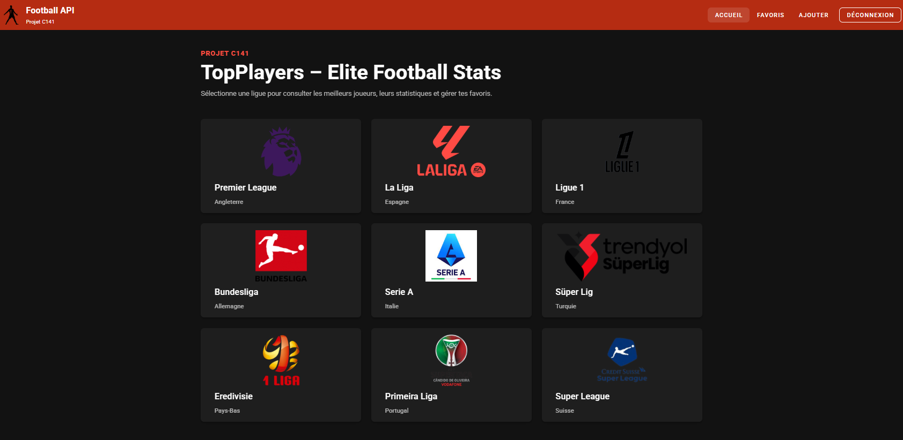
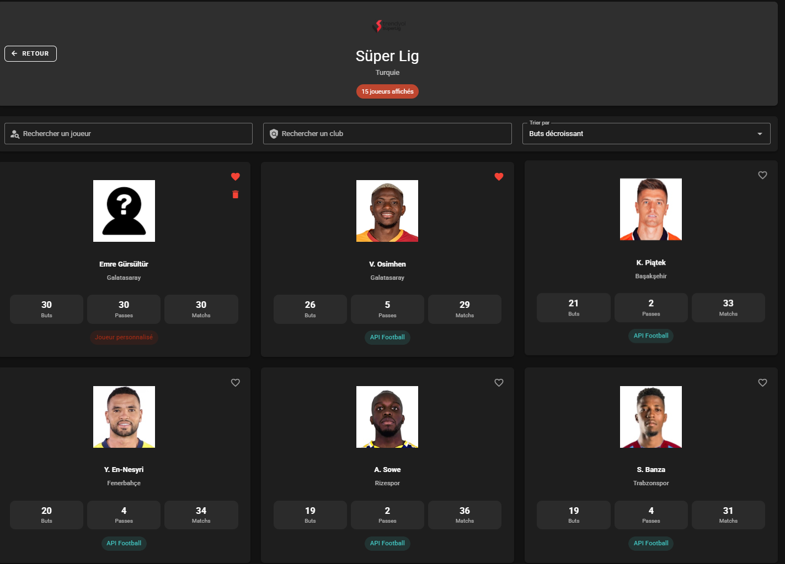
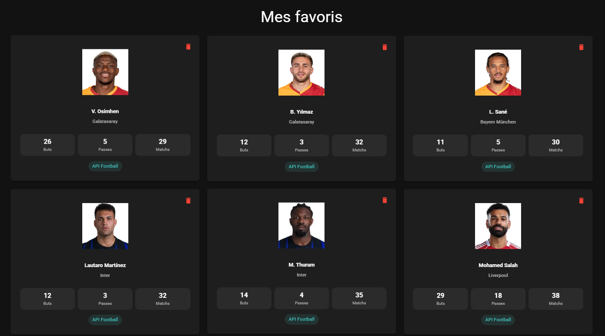

# TopPlayers — Elite Football Stats
# TopPlayers — Elite Football Stats



Application Vue.js 3 + Vuetify 3 réalisée dans le cadre du cours C141.

Cette application permet de consulter les meilleurs buteurs de plusieurs ligues européennes grâce à l’API Football.

Application Vue.js 3 + Vuetify 3 réalisée dans le cadre du cours C141.

Cette application permet de consulter les meilleurs buteurs de plusieurs ligues européennes grâce à l’API Football.

## Objectif

Développer une application web moderne avec Vue.js et Vuetify en utilisant une API externe.

Fonctionnalités réalisées :

0. **Configuration** — Thème personnalisé football + favicon
1. **Découverte de l’API** — Requêtes GET et exploration du JSON
2. **API + affichage** — Chargement dynamique des meilleurs joueurs
3. **Navigation** — Vue Router + navigation responsive mobile
4. **Recherche & tri** — Filtrage des joueurs et tri dynamique
5. **Favoris** — Gestion des favoris avec localStorage
6. **Authentification** — Connexion simple avec Pinia
7. **Protection de routes** — Accès sécurisé aux pages protégées
8. **Ajout personnalisé** — Création de joueurs personnalisés
9. **Suppression** — Confirmation avec dialogue Vuetify
10. **Responsive design** — Compatible desktop et mobile

## Aperçu de l'application

|                 Accueil                  | Ligue |                 Favoris                  |
|:----------------------------------------:|:-:|:----------------------------------------:|
|  |  |  |

## Fonctionnalités principales

- Affichage des ligues européennes
- Consultation des meilleurs joueurs
- Recherche par joueur
- Recherche par équipe
- Tri dynamique
- Ajout de joueurs personnalisés
- Sélection des équipes selon la ligue choisie
- Gestion des favoris
- Authentification simple
- Protection des routes
- Navigation responsive
- Thème dark personnalisé
- Sauvegarde locale avec localStorage
- Gestion des erreurs et chargements

## Installation

```bash
git clone https://github.com/ton-projet/topplayers.git
cd topplayers
npm install
npm run dev